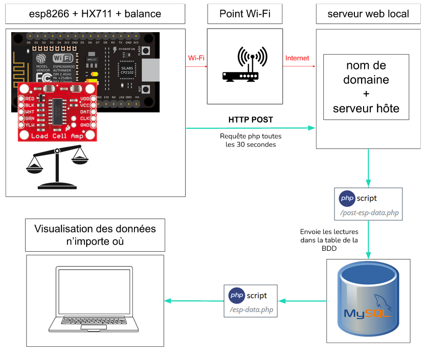

 
#  **Projet balance réseaux**
 
 
 
**Introduction :** Le projet consiste à mettre en place des balances, chacune d’entre elles enverra ses données :
* Soit sur un **google sheets** (nous n'aborderons pas cette partie)
* Soit sur une **BDD**.
* Par **Wi-Fi** donc sans fil
> * **BDD :** Base de données (fr) / **DB :** Database (en)
 
 
Pour mettre en place la base de données, on va avoir besoin de :
* **Héberger** un serveur et un nom de domaine
* **Un script php** pour insérer des données dans MySQL et l’afficher sur une page web
* **Une BDD** pour stocker les données
 
 

# **Prérequis :**

 

**Matériel :**
* **esp8266** : Carte de développement étant doté du wifi.
* **HX711** : Cellule de charge qui nous permettra d’avoir les mesures de la balance
* **Une balance** : Capteur qui renvoie une masse (en grammes)
 
 
**Logiciels :**
* **IDE Arduino :**
Cela nous permet de téléverser le code sur l’esp8266
(Pas utile pour la base de données mais pour transmettre
les mesures par la suite).
* **Serveur Apache :**
Cela nous permet d’héberger notre page web localement
afin d’y écrire nos script php pour stocker les données
dans une base de données
* **MySQL :**
Nous permet de créer des bases de données
* **PHP et phpmyadmin :**
Nous permet d’envoyer les données de la page web vers phpmyadmin en utilisant des requêtes PHP.
 
 
Pour me simplifier la tâche, j’ai décidé d’utiliser **XAMPP** qui comprend l’ensemble des logiciels cités au dessus (et plus) afin de mettre en place un serveur web local
 
 

# **Vue globale du projet :**

 

 
 

# **Mise en pratique**

 
 
 
Le projet va se diviser en **trois étapes** principales :
* 1 - Brancher la balance au HX711 puis connecter le HX711 vers l'esp8266 (ou l'esp32)
* 2 - Mettre en place le serveur web local
* 3 - Télécharger le dossier et effectuer des modifications
 
  
 
## **Etape 1 :** Brancher la balance au HX711 puis connecter le HX711 vers l'esp8266
 
 
 
| Balance ->    | HX711          | - | HX711->    | ESP8266    |
| :--------     |:--------------:|-:| :--------  |:-----------:|
| excitation +  |   RED/E+       |  | GND        |   GND       |      
| excitation -  | BLACK/E-       |  | 2.7V - 5V  | 3.3V ou 5V  |
| signal -      | WHITE/A-       |  |  DAT       | D2          |
| signal +      | GREEN/A+       |  | CLK        | D3          | 

 
 
 
## **Etape 2 :** Mettre en place le serveur web local

 
 
 
Pour cette partie, nous allons tout simplement héberger un serveur web local grâce a **Xampp**, un logiciel qui hébergera notre serveur **MySQL** (contenant notre BDD) et notre serveur **Apache**.
 
 
Lien téléchargement Xampp : https://www.apachefriends.org/download.html
 
 
Une fois Xampp téléchargé et installé, lancez **"Xampp Control Pannel"** en mode administrateur. Lancez Apache et MySQL en appuyant sur le bouton **Start** puis cliquer sur le bouton **Admin** de MySQL (Faites la même opération pour Apache).
 
 
En cliquant sur admin de **Apache** vous tombez sur une page du type : **"localhost/dashboard".**  
En cliquant sur admin de **MySQL** vous tombez sur une page du type : **"localhost/phpmyadmin".**
>Attention : Si le serveur Apache ne se lance pas, il faut modifier le port de ce dernier( par défaut à 80) et le mettre sur 8080.
>>Pour modifier, cliquez sur : config(bouton en haut à droite) -> Service and Port Settings | Vous pouvez maintenant saisir "8080".  
 
Une fois arrivé sur phpmyadmin, il nous suffit dorenavant de créer une base de données que l'on peut nommer par exemple "scaledata". Cette base de données va contenir plusieurs tables, chaque table sera attribué à une balance. On va par exemple commencer à créer la première table "espdata1" pour la 1ère balance.
> Remarque : nous ne sommes pas obligés de créer une table par balance, nous pouvons aussi créer un enregistrement propre à chaque balance. L'inconvénient est que si l'on veut augmenter le nombre de balances, il faut mettre à jour la table.

 
 
## **Etape 3 :** Télécharger le dossier et effectuer des modifications
 
 
Pour la dernière étape, il suffit de télécharger le dossier du projet. Il comprend :
* Le fichier **post-esp-data.php** qui va permettre de stocker les données de l'arduino et les envoyer dans une BDD dans le serveur MySQL.
* Le fichier **esp-data.php** qui va nous permetter de visualiser les données  
 
Il faudra tout de même faire attention à modifier dans ces fichiers php les parties suivantes :
* **$dbname =** 'nom de la base de données';
* **$dbuser =** 'nom d'utilisateur de la base';  
* **$dbpass =** 'mot de passe utilisateur';
* **$dbhost =** 'nom d'hote (en général localhost)'; 

 
 
Enfin le dossier comprend les fichiers arduino :
* **Esp_vers_sheets**
* **Esp_vers_BDD**
 
 
Il faudra modifier dans Esp_vers_BDD les parties suivantes :
* **const char serverName =** "Nom du serveur/post-esp-data.php";
> **Attention :** si vous avez comme nom de serveur par exemple :"https://youpi.com/post-esp-data.php". Il faudra enlever le "s" du https pour que cela marche :"http://youpi.com/post-esp-data.php".
 
* **String apiKeyValue     =** "tPmAT5Ab3j7F9";           //sert à sécuriser le site(seuls ceux qui détiennt la clé peuvent modifier les données)
* **const char ssid       =** "saisir le nom du wifi";              
* **const char password   =** "saisir le mot de passe wifi";        
 
 
Enfin, il ne reste plus qu'à téléverser le code sur l'esp. Si tout se passe bien vous devrez avoir ceci qui est affiché sur le moniteur série d'arduino :

 * 1 - L'ESP se connecte au Wi-Fi
 * 2 - Initiatisation de la balance Arduino
 * 3 - l'ESP se connecte au fichier post-esp-data.php et nous renvoie la réponse http
> * Si la réponse http de 200, alors vous êtes bien connectés à votre fichier post-esp-data.php
> * Si la réponse http est de 400, vous avez probablement oublié d'enlever le "s" de de https dans votre variable qui stocke le nom du serveur
 
 Ensuite, vérifiez votre fichier post-esp-data.php en l'ouvrant dans le navigateur :
>insérer l'image drive 3
 
 Puis il ne vous reste plus qu'à vérifier si les données sont bien enregistrées dans la BDD :

 
### Si tout marche bien, alors félicitation !
 
 
 
 

